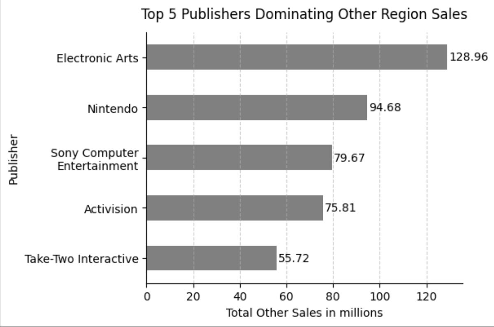
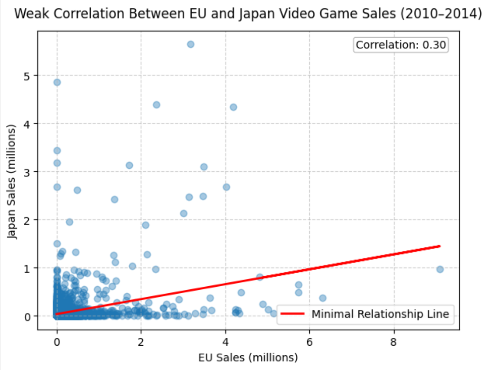
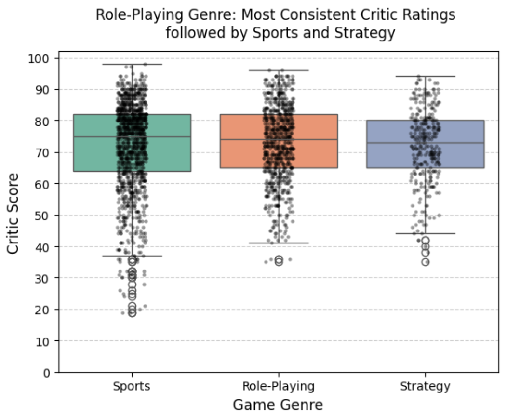
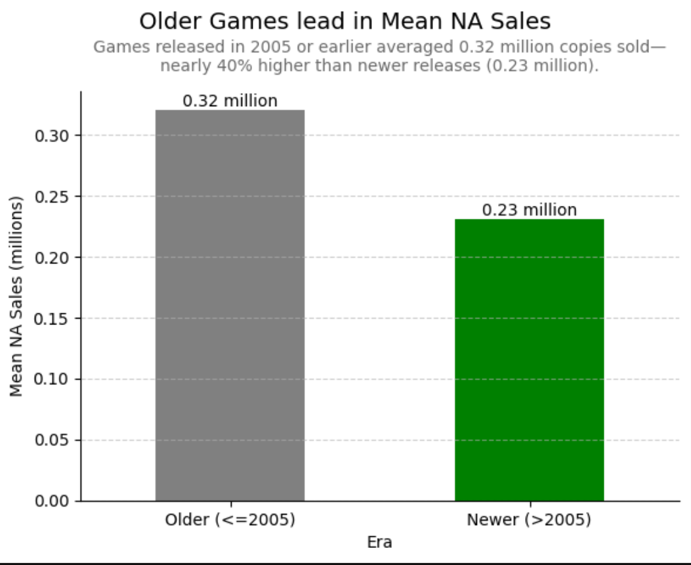
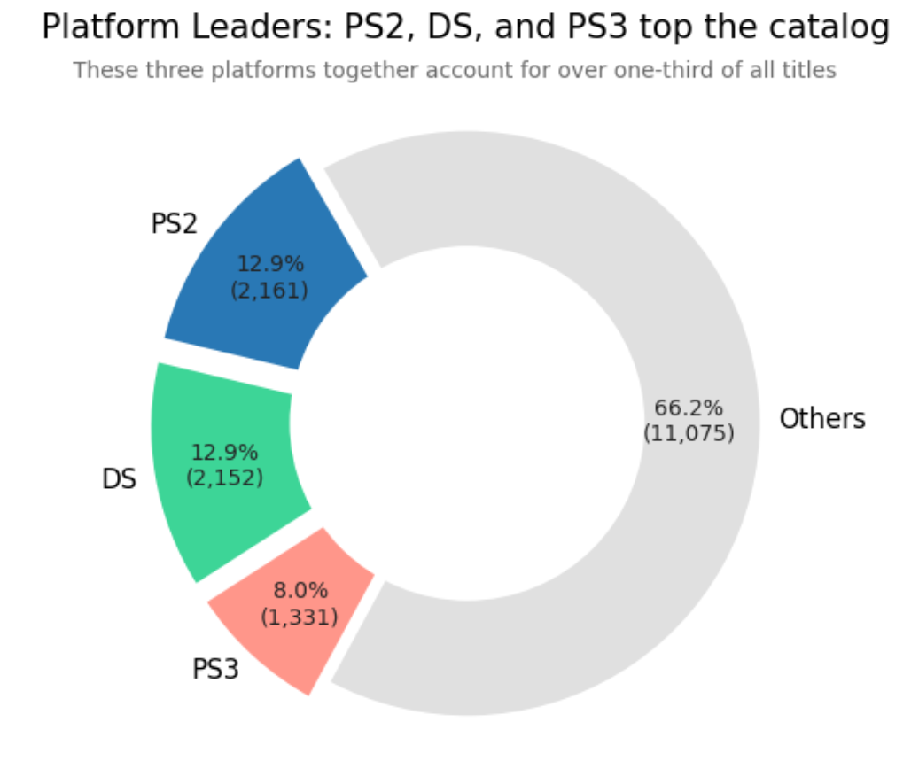
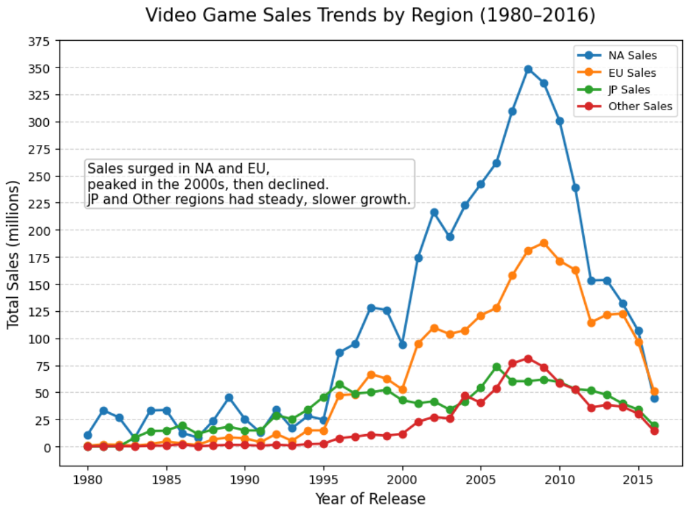

# Analysis of Video Game Sales

## Project Overview
This project explores the evolution of global video game sales across different platforms, genres, and regions using structured exploratory data analysis (EDA) and visualization. The notebook focuses on identifying sales trends, comparing critical reception across categories, and statistically evaluating long-term regional growth using regression analysis.

The study provides visual and statistical insights into how market dynamics have shifted over time, enabling understanding of platform dominance, regional variations, and sales performance across console generations.

---

## Objectives
1. Investigate the distribution of sales across regions (North America, Europe, Japan, and Others).
2. Identify top-performing platforms and genres by sales and critic ratings.
3. Analyze the difference in sales between older and newer games (before and after 2005).
4. Determine statistically significant sales trends over time.

---

## Dataset Description
The dataset includes information on video game titles released across multiple decades, featuring:

- **Columns:** Name, Platform, Year_of_Release, Genre, Publisher, NA_Sales, EU_Sales, JP_Sales, Other_Sales, Global_Sales, Critic_Score.
- **Source:** Open-source video game sales dataset (commonly available on Kaggle).
- **Size & Coverage:** Approximately 16,000 rows with global coverage from 1980 to 2016.
- **Preprocessing steps:**
  - Missing values examined and excluded where necessary (notably Year_of_Release).
  - Data type conversions for numerical analysis.
  - Outlier removal and filtering for targeted visualization.
  - Categorical consolidation (e.g., grouping lesser-represented platforms under “Others”).

---

## Methodology

### 1. Data Cleaning and Preprocessing
- Used **pandas** for handling missing data, type conversions, and derived feature creation (e.g., *Older 2005* vs. *Newer 2005*).
- Excluded null entries for year-based analyses to preserve trend validity.
- Conducted categorical summarization using `value_counts`, `mean`, and `groupby` operations.

### 2. Exploratory Analysis
- Identified **top-performing genres** based on average critic scores, revealing that role-playing and sports genres maintain consistent performance.
- Analyzed **long-term platform presence**, highlighting that PlayStation 2, Nintendo DS, and PlayStation 3 represent over one-third of the catalog.
- Compared **era-based sales** and found that pre-2005 games achieved approximately 40% higher mean North American sales than newer titles.

### 3. Visualization Techniques
Implemented multi-layered visualizations using **matplotlib** and **seaborn**, tailored for communication and readability:
- **Boxplots and Stripplots** for genre score comparisons.
- **Donut Pie Chart** to show platform distribution dominance with annotated percentages and counts.
- **Time Series Line Chart** for yearly regional sales trends with regression trendline interpretation.
- **Annotated Bar Charts** to illustrate mean sales across historical eras.

### 4. Statistical Analysis
- Conducted linear regression using **scipy.stats.linregress** to determine slope, p-value, and r-value for regional sales trends (1980–2016).
- Results revealed statistically significant positive trends across all regions, particularly in **Europe** (r = 0.85, p < 0.001), followed by **North America** (r = 0.71).
- Findings confirm consistent global growth with varying regional maturity rates.

---

## Technologies Used

| Library / Tool | Purpose |
|-----------------|----------|
| Python | Core programming environment |
| Jupyter Notebook | Development and presentation medium |
| pandas | Data cleaning and aggregation |
| matplotlib | Visualization and figure customization |
| seaborn | Advanced statistical visualizations |
| scipy.stats | Linear regression and statistical testing |
| NumPy | Numerical computation and array handling |

---

## Key Insights
- **Regional Sales Relationship:** EU and Japan game sales show only a weak positive correlation from 2010 to 2014, indicating limited market overlap.
  
  

  

  
- **Global Publisher Presence:** Electronic Arts and Nintendo lead in 'Other' region sales, highlighting their strong international reach beyond core regions.

    

  

  
- **Consistency:** Role-Playing titles maintain the narrowest critic score distribution, indicating higher rating reliability across releases.

  

  

  
- **Sales Period Comparison:** Older titles (≤2005) outperform newer ones in average sales by 40%, revealing generational market saturation.

  

  

  
  
- **Longevity:** Legacy platforms (PlayStation 2, DS, PS3) accounted for one-third of all releases, emphasizing console-driven stability.

  

  

  
- **Regional Dynamics:** North America and Europe dominated global growth during the early 2000s, though both saw declines post-2010.

  

  

---

## Limitations
- Missing entries (~269) in *Year_of_Release* reduced sample coverage for time-series analysis.
- Potential underestimation of total sales due to unclassified recent or regional-specific titles.
- Dataset ends at 2016 — post-2017 digital sales trends are not included.

---

## Conclusion
This project provides a comprehensive, statistically validated overview of the global video game industry’s performance over several decades. Through structured analysis, it enables understanding of platform longevity, sales evolution, and critical acclaim distribution.

The findings contribute meaningful business intelligence for game publishers, market analysts, and investors while showcasing advanced data storytelling and visualization practices.
